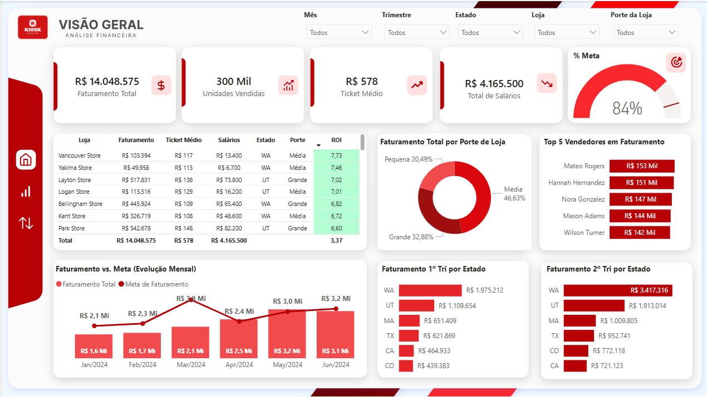

# 📊 Comercial - Análise Financeira e Vendas

## 📖 Sobre o Projeto
Este projeto foi desenvolvido para atender ao desafio de analisar a área de vendas de uma rede varejista. O objetivo central é fornecer à área de negócios uma aplicação interativa que permita o cruzamento ágil de informações, análises comparativas e visões temporais do negócio estatisticamente confiáveis.

A solução projetada é de ponta a ponta (End-to-End): engloba desde o fluxo de transformação de dados (ETL/ELT) até a construção de um painel (Dashboard) interativo com alta qualidade de design.

## 🏗️ Arquitetura e Stack de Dados (ETL / ELT)
A pipeline de dados utiliza uma stack moderna, onde a transformação foi construída com Dbt, com foco em escalabilidade, controle e performance:

- **Dbt:** Responsável pela etapa de tranformação (ETL/ELT). O Dbt aplica as regras de negócio, realiza a limpeza dos dados, faz a modelagem do Data Warehouse em diferentes camadas (Staging, Marts) e finaliza exportando de maneira automatizada as tabelas em `.parquet`.
- **Python:** Utilizado de forma enxuta para a extração primária e orquestração do pipeline.
- **DuckDB:** Atua como o motor e banco de dados analítico (OLAP), processando as consultas de alta performance geradas pelo Dbt.
- **Power BI:** Camada semântica, cálculos em DAX e visualização de dados.

### Modelagem Dimensional (Star Schema)
Os modelos processados geram arquivos `.parquet` otimizados para consumo analítico pelo Power BI:
- **Fato:** `mart_faturamento` (Transações de Venda), `mart_metas` (Objetivos).
- **Dimensões:** `mart_lojas` (Locais físicos), `mart_vendedores` (Força de Vendas), `mart_calendario` (Tempo).

---

## 🎯 Solução Visual e Atendimento aos Requisitos


O dashboard **"Visão Geral - Análise Financeira"** atende 100% os critérios solicitados pelo desafio:


1. **Analisar o faturamento:** Totalizador claro de Faturamento Total (KPIs de topo) e distribuição percentual do faturamento conforme o "Porte da Loja".
2. **Analisar as unidades, de acordo com as metas:** O total de "Unidades Vendidas" é monitorado cruzado com a "Meta", possuindo um medidor exato de preenchimento do alvo (% Meta). Há também um gráfico de linha do tempo com a Evolução Mensal do Faturamento Realizado vs Meta projetada.
3. **Analisar o histórico de vendas por vendedor:** Aplicação de um Ranking dinâmico evidenciando os "Top 5 Vendedores em Faturamento".
4. **Analisar o salário dos colaboradores:** Matriz analítica de detalhes contendo não apenas os Custos com "Salários" globais, mas também uma análise avançada elaborando o cálculo de **ROI** (Retorno sobre Investimento / Faturamento x Salário) por Loja.
5. **Ticket médio das lojas:** Cartão dinâmico com Ticket Médio global e o ticket detalhado e visível individualmente por cada loja na tabela central.
6. **Análises Adicionais Livres:** Visualização de impacto sazonal de faturamento dividido no **1º e 2º Trimestre comparando o desempenho por Estado**.

---

## 🚀 Como Executar o Projeto

1. Clone o repositório para a sua máquina local.
2. Crie e ative um ambiente virtual (VENV):
   ```bash
   python -m venv venv
   source venv/Scripts/activate  # No Windows: .\venv\Scripts\activate
   ```
3. Instale as dependências:
   ```bash
   pip install -r requirements.txt
   ```
4. Rode a rotina completa de ETL no terminal:
   ```bash
   python run_pipeline.py
   ```
   *(As tabelas finais tratadas serão exportadas como `.parquet` na pasta `output/parquet/`).*

---

## 🔮 Melhorias Futuras e Roadmap
Como o projeto baseia-se em uma arquitetura de dados escalável, ele pode evoluir em várias frente de negócios. Sugestões de próximas páginas para o Dashboard do Power BI:

1. **🤝 Painel de Pelo de Desempenho (Profissional/RH):**
   - Um drill-down profundo construído em uma nova página focado unicamente na equipe: meta alcançada por cada funcionário, curva de aprendizado (relação salário vs faturamento com o tempo) e projeções de comissão.
2. **📦 Mix e Rentabilidade de Produto:**
   - Ingestão de tabelas de categorias de produto do sistema de origem para o pipeline em Python/dbt.
   - Entender qual o produto "A" (da curca ABC) que mais contribui pro Ticket Médio e para a Margem de Lucro dentro de cada "Porte de Loja" específico.
3. **📈 Forecast Automatizado (Previsão Matemática):**
   - Aproveitar os dados de histórico dentro do Python para projetar estatisticamente no Power BI qual é a tendência calculada de faturamento para o 3º e 4º Trimestres com base nos algoritmos de previsão de série temporal (*Time Series Analysis*).
  
---
💡 *Além destas melhorias citadas, a arquitetura escalável de dados construída no projeto abre portas para outras possibilidades analíticas e inovações a serem exploradas no futuro.*

